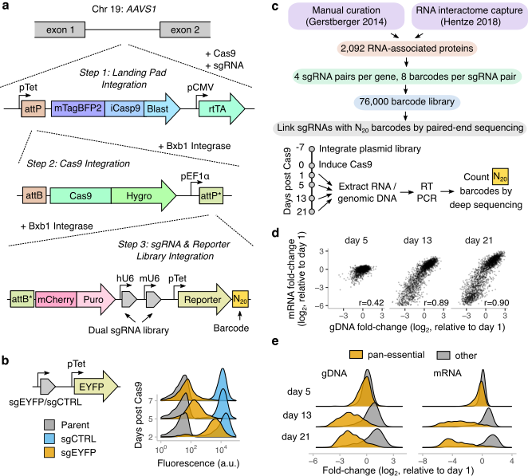
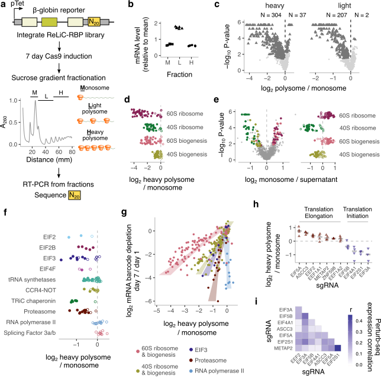
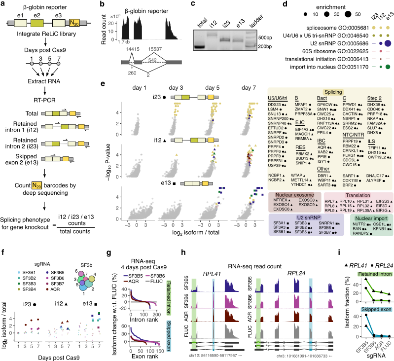
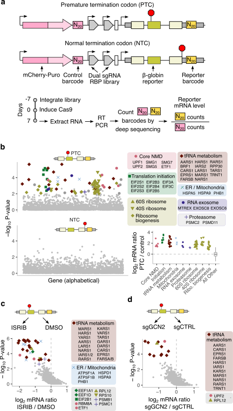
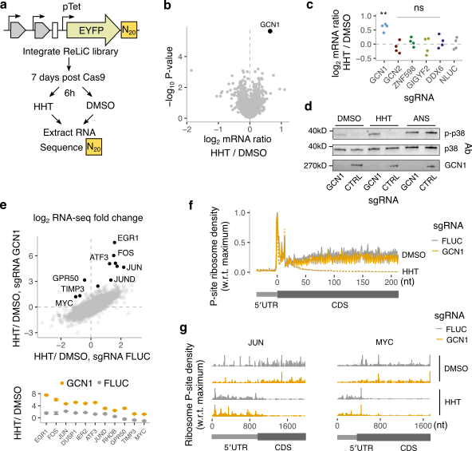

Patrick J. Nugent^1,2^, Heungwon Park^1^, Cynthia L. Wladyka^3^, Jamie Yelland^1^, Sayantani Sinha^4^, Katharine Y. Chen^1,2^, Christine Bynum^1,5^, Grace Quarterman^1,5^, Stanley C. Lee^4^, Andrew C. Hsieh^3,6^, Arvind Rasi Subramaniam^1,7,†^

^1^ Basic Sciences Division and Computational Biology Section of the Public Health Sciences Division,
Fred Hutchinson Cancer Center, Seattle WA, USA  
^2^ Molecular and Cellular Biology Graduate Program,
University of Washington, Seattle WA, USA  
^3^ Human Biology Division,
Fred Hutchinson Cancer Center, Seattle WA, USA  
^4^ Translational Science and Therapeutics Division, Fred Hutchinson Cancer Center, Seattle WA, USA  
^5^ Department of Biology,
Spelman College, Atlanta GA, USA  
^6^ Department of Medicine and Department of Genome Sciences, 
University of Washington, Seattle WA, USA  
^7^ Department of Biochemistry and Department of Genome Sciences, 
University of Washington, Seattle WA, USA

 ^†^ Corresponding author: A.R.S: <rasi@fredhutch.org>

# Abstract

RNAs undergo a complex choreography of metabolic processes that are regulated by thousands of RNA-associated proteins.
Here we introduce ReLiC, a scalable and high-throughput RNA-linked CRISPR approach to measure the responses of diverse RNA metabolic processes to knockout of 2,092 human genes encoding all known RNA-associated proteins.
ReLiC relies on an iterative strategy to integrate genes encoding Cas9, sgRNAs, and barcoded reporter libraries into a defined genomic locus.
Combining ReLiC with polysome fractionation reveals key regulators of ribosome occupancy, uncovering links between translation and proteostasis.
Isoform-specific ReLiC captures differential regulation of intron retention and exon skipping by SF3b complex subunits. 
Chemogenomic ReLiC screens decipher translational regulators upstream of mRNA decay and identify a role for the ribosome collision sensor GCN1 during treatment with the anti-leukemic drug homoharringtonine.
Our work demonstrates ReLiC as a powerful framework for discovering and dissecting post-transcriptional regulatory networks in human cells.

# Introduction

After transcription, RNAs undergo several metabolic events such as splicing, editing, localization, translation, and decay inside cells.
These RNA processes are executed by ribonucleoprotein complexes composed of RNA-binding proteins (RBPs), adapter proteins, and regulatory factors.
Over 2,000 human genes encode proteins that are part of ribonucleoprotein complexes [@Gerstberger2014;@Hentze2018].
Mutations in RNA-associated proteins occur in many human diseases such as cancer, neurodegeneration, and developmental disorders [@Gebauer2021].

Crosslinking-based biochemical approaches can identify RBP-RNA interactions[@Hentze2018] but not their functional effect on RNA metabolism.
RBPs can increase, decrease or leave unchanged metabolic events on their target RNA depending on their affinity, location, and other associated factors [@VanNostrand2020;@Ray2013].
Many RBPs also associate with multiple protein complexes and participate in several distinct RNA metabolic events [@Schneider-lunitz2021].
Conversely, protein factors that do not directly bind RNA can still affect RNA metabolism by regulating the interactions between RNAs and RBPs or by controlling the cellular level and activity of RBPs [@England2022].

Unbiased genetic screening can identify cellular factors regulating RNA metabolism, but are limited in their current form.
CRISPR screens using indirect phenotypes such as cell growth and fluorescent protein levels are difficult to engineer and interpret for many RNA metabolic events [@Przybyla2022;@Genolet2022] due to potential false positives [@Gonatopoulos-Pournatzis2018;@Scarborough2021] and genetic compensatory mechanisms [@El-Brolosy2019].
CRISPR perturbations followed by pooled single cell RNA sequencing can capture RNA phenotypes such as steady-state levels, polyadenylation status, and decay rates [@Replogle2022;@Kowalski2024;@Xu2024].
But these transcriptome-wide approaches have limited flexibility to study different types of RNA processes, show bias towards highly expressed RNAs, and remain costly and labor intensive to scale beyond a few dozen perturbations.
Thus, genome scale screening approaches to identify the RNA-centric functions of human proteins, that also have the flexibility to capture diverse RNA metabolic events, are highly desirable.

# Results

## Development of RNA-linked CRISPR screening in human cells

We reasoned that combining CRISPR-based perturbations with barcoded RNA readouts provides a general approach to study the genetic control of RNA processes in human cells. 
Indeed, RNA interference screens in human cells [@Herholt2018] and CRISPR interference screens in *S. cerevisiae* [@Muller2020;@Alford2021] have linked perturbations to barcoded transcriptional readouts.
Lentiviral delivery, commonly used for CRISPR screening in human cells, scrambles sgRNA-barcode linkages due to template switching during reverse transcription [@Sack2016] and results in variable expression of RNA barcodes due to random genomic integration [@Ellis2005].
To avoid these limitations, we used an iterative, Bxb1-mediated site-specific integration strategy to stably express doxycycline-inducible SpCas9 (Cas9 hereafter), sgRNAs, and barcoded RNA reporters from a defined genomic locus (Fig. 1a).
Using an *EYFP* reporter, we confirmed its uniform expression and Cas9-mediated depletion in HEK293T (Fig. 1b) and U2OS cells (Extended Data Fig. 1a,b).

To identify post-transcriptional regulators, we targeted 2,092 human genes encoding known RNA-associated proteins [@Gerstberger2014;@Hentze2018] (Fig. 1c).
We used a dual sgRNA design with random N~20~ barcodes in a modular vector allowing insertion of arbitrary RNA reporters (Extended Data Fig. 1c). 
Our final library targeted 2,190 genes with 4 sgRNA pairs per gene, including non-targeting and essential gene-targeting controls (Supplementary Table 1).
We linked the N~20~ barcodes to sgRNAs by paired-end deep sequencing of the cloned plasmid library.
We then integrated this library into HEK293T cells, and counted barcodes in the genomic DNA and transcribed RNA by deep sequencing (Fig. 1c, Extended Data Fig. 1d).
We recovered a median of 8 barcodes per sgRNA pair (henceforth referred to as sgRNAs) with at least one barcode for 99% of sgRNAs and 100% of all genes (Extended Data Fig. 1e), thus capturing the diversity of our input library.

To test whether sgRNA-linked barcodes capture fitness effects, we counted barcodes in genomic DNA and mRNA after Cas9 induction (Supplementary Table 6).
Barcode counts showed little systematic change 5 days after Cas9 induction (Fig. 1d, left panels).
However, on days 13 and 21 after Cas9 induction, barcode counts for a subset of sgRNAs were strongly depleted in both the genomic DNA and mRNA in a highly correlated manner (Fig. 1d, middle and right panels).
The magnitude of depletion was correlated across distinct barcode sets for each gene (Extended Data Fig. 1f), indicating the assay's technical reproducibility.
Barcodes in both genomic DNA and mRNA corresponding to annotated essential genes (n = 745) were depleted at days 13 and 21 relative to other genes targeted by our library (n = 1401, Fig. 1e).
Thus, RNA-linked CRISPR captures both the identity and fitness effect of genetic perturbations solely from sequencing of barcodes in mRNA and genomic DNA.

## ReLiC identifies regulators of mRNA translation

We first applied ReLiC to study translation, an RNA process that is not directly accessible in existing CRISPR screening methods.
We combined ReLiC with polysome profiling [@Warner1963;@Noll1963;@Gierer1963] to separate mRNAs based on their ribosome occupancy.
We used a $\beta$-globin reporter [@Zhang1998] as a model of a well-translated mRNA (Fig. 2a), inserted random barcodes into its 3$^{\prime}$ UTR, and confirmed that over 75% of the $\beta$-globin mRNA was in polysome fractions (Fig. 2b).
We then cloned the $\beta$-globin reporter into our ReLiC plasmid library, integrated the plasmids into HEK293T cells, induced Cas9 for 7 days, and fractionated cell lysates (Fig. 2a).
After counting sgRNA-linked barcodes in pooled fractions, we used MAGeCK [@Li2014] to identify sgRNAs that significantly altered the ratio of barcode counts between heavy (H) or light (L) polysomes and monosomes (M) (Supplementary Table 7). 
Polysome to monosome ratios for individual sgRNAs were highly reproducible (r=0.92 and 0.80 for H/M and L/M, respectively) between replicate experiments (Extended Data Fig. 2a).
We used an FDR threshold of 0.05 and a minimum of three concordant sgRNAs for calling gene hits that altered polysome to monosome ratios (Supplementary Table 8).

304 and 207 gene hits decreased heavy polysome to monosome and light polysome to monosome ratios, respectively (Fig. 2c).
37 gene hits increased heavy polysome to monosome ratio, while 2 increased light polysome to monosome ratio (Fig. 2c).
176 gene hits overlapped between the heavy and light polysome ratios, indicating a largely concordant effect of gene knockouts on different polysome fractions.
The skewed distribution of gene hits with more perturbations decreasing ribosome occupancy likely arises from the efficient translation of $\beta$-globin mRNA in unperturbed cells (Fig. 2b).
Consistent with heavy polysome fractions containing better-translated mRNAs, heavy polysome to monosome ratios were more sensitive to perturbations with more gene hits and larger effect sizes than light polysome to monosome ratios (Fig. 2c).
We therefore focused on heavy polysome to monosome ratios for further analyses.

Gene hits that decreased polysome to monosome ratios were highly enriched for cytoplasmic ribosomal proteins and ribosome biogenesis factors (Extended Data Fig. 2b).
On average, knockout of large ribosomal proteins and biogenesis factors decreased polysome to monosome ratios more than knockout of small ribosomal proteins and biogenesis factors (Fig. 2d).
Sequencing of barcodes in supernatant fractions revealed that knockout of small ribosomal proteins and biogenesis factors led to increased barcode representation in the supernatant relative to monosomes, while knockout of large ribosomal proteins and biogenesis factors had the opposite effect (Fig. 2e).
This observation is consistent with small ribosomal subunit depletion preventing association between mRNAs and ribosomes, while large ribosomal subunit depletion still allowing scanning by one or more small ribosomal subunits.
Indeed, barcode ratios between supernatant and polysome revealed comparable effects of small and large ribosomal perturbations (Extended Data Fig. 2c).

Depletion of most translation initiation factors also decreased heavy polysome to monosome ratios, but their effects were generally smaller than the effect of ribosomal protein depletion (Fig. 2f).
Some initiation factor subunits not classified as hits (open circles, Fig. 2f) still had multiple sgRNAs that decreased heavy polysome to monosome ratio, but either fell just below our gene-level FDR threshold (EIF4G1), or did not meet our stringent criterion of 3 distinct sgRNAs with significant effects (EIF2S2, EIF4E).
In the case of the 12-subunit EIF3 and associated EIF3J, the seven subunits A,B,C,D,E,G, and I called as hits are the same ones that severely reduce polysome to monosome ratio and fitness when depleted by siRNA in HeLa cells [@Wagner2016].
While most canonical initiation factors emerged as hits upon comparison of polysome fraction to either the monosome or the supernatant fractions, a few genes such as XRN1, DDX6, and SNTB1 emerged as hits only in the polysome to supernatant comparison (Extended Data Fig. 2d).
Aminoacyl-tRNA synthetase knockouts had mild and variable effects on ribosomal occupancy (Fig. 2f), presumably reflecting a balance between their direct effect on elongation and indirect effect on initiation through GCN2 and EIF2$\alpha$ phosphorylation [@Darnell2018].

We identified several knockouts outside the core translation machinery with decreased polysome to monosome ratio (Fig. 2f).
Subunits of the CCR4-NOT complex (CNOT1, CNOT2, CNOT3, and CNOT7), which has been implicated in a wide range of RNA metabolic processes [@Collart2016], emerged as hits in our screen.
Knockout of proteasome and TRiC chaperonin subunits led to substantially reduced polysome to monosome ratios, comparable in magnitude to knockout of core translation initiation factors (Fig. 2f).
We validated these effects by creating individual knockout lines, and observed reduced bulk polysome to monosome ratios after 3 days of proteasomal or chaperonin depletion (Extended Data Fig. 2e).
These complexes did not arise as hits only due to their essentiality since knockout of other essential cellular complexes such as RNA polymerase II and splicing factor 3a/b (SF3) did not reduce polysome to monosome ratio (Fig. 2f).
While neither the proteasome nor the TRiC chaperonin complex has been directly associated with translational regulation, they play a critical role in maintaining cellular proteostasis by coordinating their activities with translation [@Harper2016;@Frydman2012].
Our results suggest a reciprocal regulation of translation in response to changes in proteasomal and chaperonin capacity.

## Relation between ribosome occupancy and growth fitness

Ribosome occupancy on mRNAs is often correlated with cellular growth rate, with slower growth accompanied by lower polysome to monosome ratio across different growth conditions and organisms [@Balakrishnan2022;@Metzl-Raz2017;@Wagner2016].
Our measurements of both depletion of barcodes and their polysome distribution across thousands of gene perturbations allowed testing the generality of the relationship between ribosome occupancy and growth.
Across all perturbations, decrease in polysome to monosome ratio was positively correlated with barcode depletion in both mRNA and genomic DNA but had a wide distribution (Extended Data Fig. 2f).
However, gene groups corresponding to different molecular complexes had characteristically distinct relationships between ribosome occupancy and barcode depletion.
Perturbing ribosomal proteins and biogenesis factors resulted in the largest decrease in polysome to monosome ratio relative to fitness, followed by EIF3 (Fig. 2g, Extended Data Fig. 2g).
Perturbing proteasomal subunits produced a smaller but still significant decrease in ribosome occupancy, while perturbing RNA polymerase II subunits did not alter ribosome occupancy despite their significant effects on barcode depletion (Fig. 2g, Extended Data Fig. 2g).
Hence, the coupling between growth rate and ribosome occupancy in human cells is not invariant across all perturbations, but depends on the pathway or the molecular process that leads to growth limitation.

## Regulatory factors that increase ribosome occupancy

We next examined the small group of gene knockouts that increased the heavy polysome to monosome ratio (Fig. 2h, brown triangles).
Knockout of EEF2, EIF5A, and EEF1A increased polysome to monosome ratio, consistent with their role in promoting translation elongation.
Intriguingly, the ribosome-associated quality control factor ASCC3 was the top gene hit for increased heavy polysome to monosome ratio (log~2~H/M = 0.62, FDR = 1e-4).
Since ASCC3 is involved in splitting stalled ribosomes on mRNAs [@Juszkiewicz2020], its presence here suggests that even well-translated mRNAs such as $\beta$-globin undergo some degree of ribosome stalling and quality control.
Further, knockout of the ribosome collision sensor ZNF598, which acts upstream of ASCC3 [@Juszkiewicz2020], also increased ribosome occupancy (log~2~H/M = 0.19, FDR = 0.06, p = 0.007).
Knockout of METAP2, which removes methionine from the N-terminus of nascent polypeptides, increased ribosome occupancy (log~2~H/M = 0.22, FDR = 0.001, p = 3e-4), pointing to an effect of nascent peptide processing on the kinetics of mRNA translation.

Finally, we asked whether differential effects of gene perturbations on ribosome occupancy as measured by polysome to monosome ratios are reflected in their cellular transcriptional response.
Using a genome-scale Perturb-seq dataset [@Replogle2022], we correlated and clustered the transcriptional profiles of translation factor perturbations that had concordant or discordant effects on ribosome occupancy (Fig. 2i).
Perturbations with concordant effects on ribosome occupancy (Fig. 2h) did not show a higher correlation with each other than with perturbations with discordant effects on ribosome occupancy.
For example, depletion of METAP2 and EIF2S1 (EIF2$\alpha$), which are direct interactors [@Datta1988], had a markedly higher correlation in their transcriptional responses even though these gene knockouts had discordant effects on ribosome occupancy (Fig. 2h).
Thus, the effects of gene perturbations on ribosome occupancy measured by ReLiC are distinct from their downstream transcriptional responses.

## Isoform-specific splicing screens using ReLiC

Existing screening approaches to study RNA splicing require careful design of fluorescent protein reporters [@Gonatopoulos-Pournatzis2018] and can result in high false positive and negative rates [@Scarborough2021].
We reasoned that ReLiC will allow us to directly measure the ratio of different splice isoforms carrying the same barcode, thereby capturing the effect of the linked sgRNA perturbation on splicing.
To test this idea, we used the same $\beta$-globin reporter as in our translation screen (Fig. 3a), and confirmed the canonical isoform with three exons as the most abundant one (Fig. 3b).
We then performed three isoform-specific screens for regulators that increase intron 1 retention (i12), intron 2 retention (i23), or exon 2 skipping (e13) (Fig. 3a).
After harvesting RNA 1, 3, 5 and 7 days after Cas9 induction, we selectively amplified each isoform along with the barcode (Fig. 3c).
We measured the ratio of barcode counts between each isoform and the total RNA pool and used an FDR threshold of 0.05 and a minimum of three concordant sgRNAs for calling gene hits (Supplementary Table 8).
For all three isoforms, the number of gene hits progressively increased with longer duration of Cas9 induction (Extended Data Fig. 3a).
Fewer gene knockouts increased the exon 2-skipped isoform in comparison to the two intron-retained isoforms at all time points (Extended Data Fig. 3a).
Effect sizes of gene hits were reproducible across distinct barcode sets for each gene (Extended Data Fig. 3b) and specific to each isoform (Extended Data Fig. 3c). 

The three isoform-specific screens identified both common and unique sets of gene hits that were evident by automated gene ontology analysis (Fig. 3d) and by manual inspection (Fig. 3e).
Gene hits in the two intron retention screens were dominated by core spliceosome components and splicing-associated factors (yellow circles and triangles, Fig. 3e).
Spliceosome hits were distributed throughout the splicing cycle starting from the tri-snRNP complex that is required to form the catalytically active spliceosome and included members from most known spliceosomal subcomplexes [@Wahl2015].
Our screen also identified *trans* regulators of spliceosomal function such as CDK11B – a recently identified activator of the SF3b complex [@Hluchy2022], and BRF2 – an RNA polymerase III subunit required for transcription of U6 snRNA.

Retention of intron 1 was promoted by an additional group of gene knockouts that were enriched for mRNA translation and nuclear RNA exosome factors (red and brown triangles, Fig. 3e).
Loss of ribosomal proteins and translation factors might inhibit nonsense-mediated decay (NMD) of the intron 1-retained isoform, while the effect of nuclear RNA exosome components might be indirect through their role in ribosome biogenesis.
While retention of either intron 1 or intron 2 will generate a premature termination codon (PTC), only the intron 1-retained isoform will have a splice junction and an associated exon-junction complex (EJC) downstream of the PTC, which is a well-known trigger for NMD [@Cheng1994].
Consistent with a role for NMD, EJC components (MAGOH, EIF4A3, RBM8A) and RNA export factors (NCBP1, NCBP2) emerged as hits only in the intron 1 retention screen (Fig. 3e), and several NMD factors such as UPF2 and SMG1 increased intron 1 retention even though they fell below our FDR threshold for calling hits (Supplementary Table 8).

## Differential effects of SF3b complex subunits on splicing

In contrast to intron retention, perturbations increasing exon 2 skipping were enriched for a narrow set of splicing factors.
Components of the U2 snRNP, most notably several members of the SF3 complex, were among the top hits (purple squares, Fig. 3e), suggesting that their depletion allows some degree of splicing but impairs the correct selection of splice sites.
This is consistent with the subtle alterations in exon skipping caused by disease-causing mutations in the SF3b complex [@Darman2015].
Exon 2 skipping was also promoted by perturbing components involved in nuclear protein import (green squares, Fig. 3e), presumably through their effect on nuclear import of U2 snRNP proteins after their synthesis in the cytoplasm.
Perturbing individual components of the 7-subunit SF3b complex [@Cretu2016] had distinct effects on exon skipping and intron retention (Fig. 3f), even though all 7 subunits are essential for cell growth (Extended Data Fig. 3d).
Exon 2 skipping was greatly increased upon loss of the subunits SF3B1, SF3B2, SF3B3, SF3B5, slightly increased by loss of SF3B7, and unaffected by loss of SF3B4 and SF3B6 (Fig. 3f).
Intron 2 retention was increased by loss of SF3B6 and SF3B7, while intron 1 retention was increased by loss of SF3B1, SF3B2, and SF3B5 (Fig. 3f).
By contrast, loss of the activating helicase AQR increased the retention of both introns 1 and 2 (brown markers, Fig. 3f).

We next examined how the differential effects of SF3b subunit depletion on $\beta$-globin reporter splicing extend to endogenous mRNAs.
To this end, we generated HEK293T cell lines with the subunits SF3B5 and SF3B6, which affected distinct splicing events in our screen, individually depleted.
We also targeted AQR, a top hit in both our intron retention screens, as a positive control and included a non-targeting control sgRNA (FLUC).
We performed RNA-seq 4 days after Cas9 induction to identify endogenous splicing events that are particularly sensitive to the respective genetic perturbations.
Loss of SF3B5 increased skipping of 45 annotated cassette exons by 10% or higher (Fig. 3g).
Loss of SF3B6 or AQR affected the skipping of less than 10 cassette exons at the same effect size, while all three splicing factors increased aberrant retention of a similar number of distinct introns (Fig. 3g).
Interestingly, for genes such as RPL24 and RPL41, increased intron retention and exon skipping upon SF3B5 loss occurred at distinct splice sites within the same transcriptional unit (Fig. 3h,i).
In summary, the differential effects of SF3b subunits on splicing of the $\beta$-globin reporter extend to endogenous mRNAs with a subset of SF3b subunits playing a more prominent role in regulating exon skipping.

## ReLiC screen for regulators of mRNA quality control

We reasoned that sequencing mRNA barcodes using ReLiC provides a general approach to identify regulators of mRNA quality control pathways independent of their effect on protein expression.
To test this idea, we modified our $\beta$-globin reporter to add a premature termination codon (PTC) at position 39 in the second exon (Fig. 4a), which is known to trigger NMD [@Zhang1998].
At steady state, mRNA levels of the PTC-containing reporter were strongly reduced relative to a reporter with a normal termination codon (NTC, Extended Data Fig. 4a).
To measure mRNA effects specific to the PTC and NTC reporters, we combined our ReLiC-RBP library with a dual barcoding strategy [@Muller2020] to normalize barcode counts for the reporter of interest relative to that of the mCherry-puro selection marker within each cell (Fig. 4a).
We harvested RNA 7 days after Cas9 induction and counted mRNA barcodes for the PTC and NTC $\beta$-globin reporters and the mCherry-puro marker.

We identified 90 gene hits (FDR < 0.05, 3 sgRNAs with concordant effects) whose knockout increased levels of the PTC reporter relative to the mCherry-puro marker (Fig. 4b, Extended Data Fig. 4c).
We did not get any hits that increased mRNA levels of the NTC reporter, as expected from its higher mRNA stability (Fig. 4b, Extended Data Fig. 4c).
Several core components of the NMD pathway (UPF1, UPF2, SMG1, SMG5, SMG7, ETF1) were among the gene hits for the PTC reporter, indicating our ability to identify NMD-specific factors (Fig. 4b, pink circles).
Other NMD-associated factors such as SMG6 and EIF4A3 fell just below the FDR threshold but still significantly (MAGeCK P-value < 0.05) increased mRNA levels of the PTC reporter.
Remarkably, a large proportion of gene hits for the PTC reporter encoded core factors involved in various steps of mRNA translation (Fig. 4b, squares, triangles, and diamonds; Extended Data Fig. 4b).
These included both small and large ribosomal proteins, ribosome biogenesis factors, translation initiation factors, and aminoacyl-tRNA synthetases.
EIF2, EIF2B, and EIF3 subunits but not EIF4F subunits emerged as hits (Extended Data Fig. 4d), despite having similar effects on growth fitness (Extended Data Fig. 4e).
Further, acute chemical inhibition of EIF4E and EIF4A showed only a modest effect on PTC reporter levels in comparison with SMG1 inhibition (Extended Data Fig. 4a).
Thus, our results suggest a limited *in vivo* role for EIF4F compared to EIF2, EIF2B, and EIF3 in regulating NMD of our $\beta$-globin reporter.

## Chemical and genetic modifier screens using ReLiC

Our NMD screen also identified gene hits involved in ER and mitochondrial homeostasis (Fig. 4b, x markers).
This is consistent with phosphorylation of EIF2$\alpha$ upon perturbing ER and mitochondrial homeostasis leading to NMD inhibition[@Wang2011].
To identify regulators of NMD acting through EIF2$\alpha$ phosphorylation, we adapted ReLiC to perform a chemical modifier screen using the small molecule ISRIB that renders translation insensitive to EIF2$\alpha$ phosphorylation [@Sidrauski2013].
After inducing Cas9 for 6 days, we treated a ReLiC cell pool expressing the PTC reporter with ISRIB or DMSO for 48 hours, harvested RNA, and counted barcodes.
We identified 30 gene knockouts (FDR < 0.01) that decreased mRNA levels of the PTC reporter upon ISRIB treatment relative to the DMSO control (Fig. 4c).
These gene hits included several ER- and mitochondrially-localized proteins (Fig. 4c, x markers), consistent with their knockout inhibiting NMD through EIF2$\alpha$ phosphorylation.

Knockout of several aminoacyl-tRNA synthetases also decreased PTC reporter levels upon ISRIB treatment (Fig. 4c, diamonds), suggesting that their depletion inhibits NMD through phosphorylation of EIF2$\alpha$ rather than by decreasing translation elongation.
To test this hypothesis, we performed a genetic modifier screen using ReLiC to deplete the EIF2$\alpha$ kinase GCN2, which is activated by uncharged tRNAs accumulating upon inhibition of aminoacyl-tRNA synthetases [@Wek1995;@Dong2000].
We transduced the ReLiC cell pool with lentiviruses expressing either GCN2-targeting or non-targeting sgRNAs, induced Cas9 for 7 days, harvested RNA, and counted barcodes.
Out of the 12 gene hits (FDR < 0.01) with lower PTC reporter levels upon GCN2 depletion (Fig. 4d), 10 were aminoacyl-tRNA synthetases (Fig. 4d, diamonds), thus confirming their action through GCN2-mediated EIF2$\alpha$ phosphorylation.
Together, the above chemical and genetic modifier screens demonstrate the usefulness of ReLiC for dissecting the molecular pathways through which specific gene products regulate RNA processes.

## GCN1 regulates cellular responses to an anti-leukemic drug

Homoharringtonine (HHT) is an FDA-approved chemotherapeutic that targets the ribosome and is used to treat chronic myeloid leukemia [@Gandhi2014].
HHT binds to the large ribosomal subunit to arrest initiating ribosomes at start codons and inhibit protein synthesis [@Fresno1977;@Ingolia2011], but how cells respond to this translational arrest is not well understood.
Given ReLiC's ability to identify regulators downstream of both mRNA translation and chemical perturbations, we sought to use this approach to probe the cellular response to HHT treatment. 
To this end, we performed ReLiC screens using an EYFP reporter (Fig. 5a).
After inducing Cas9 for 7 days, we treated the cell pool with 1 $\mu$M HHT or DMSO for 6 hours before harvesting RNA and counting barcodes.

Unlike our previous ReLiC screens where we uncovered multiple gene hits and RNA metabolic pathways, a single gene, *GCN1*, emerged as a clear hit (FDR < 0.05) whose knockout increased EYFP mRNA levels during HHT treatment (Fig. 5b).
GCN1 activates the kinase GCN2 to trigger EIF2$\alpha$ phosphorylation in response to amino acid limitation [@Marton1993].
While GCN2 did not come up as a hit in our initial HHT screen, pharmacologic inhibition of GCN2 ablates the difference in EYFP mRNA levels between the GCN1 KO and control cells (Extended Data Fig. 5a).
GCN1 also binds collided ribosomes on mRNAs [@Pochopien2021], which can trigger both degradation of the nascent peptide and the mRNA [@Oltion2023;@Muller2023].
Since ribosome collisions also trigger the ribotoxic stress response (RSR) through the kinase ZAK$\alpha$ that was not included in our original screen [@Wu2020], we measured p38 phosphorylation in wild-type and GCN1-depleted cells.
HHT treatment increased p38 phosphorylation in GCN1-depleted cells (Fig. 5d) in a ZAK$\alpha$-dependent manner (Extended data Fig. 5b), while wild-type cells did not show a corresponding increase.
By contrast, treatment with the elongation inhibitor anisomycin triggered p38 phosphorylation in both wild-type and GCN1-depleted cells (Fig. 5d).

Ribosome collisions induced by elongation inhibitors trigger upregulation of immediate early gene (IEGs) mRNAs [@Sinha2020].
To test if GCN1 regulates IEGs during HHT treatment, we performed RNA-seq on wild-type and GCN1-depleted cells after HHT treatment (Fig. 5e).
HHT treatment for 6 hours caused widespread changes in mRNA levels in both wild-type and GCN1-depleted cells with ~225 up-regulated genes and ~450 down-regulated genes (> 2-fold change, p < 0.05).
However, a small group of 60 genes, which included several immediate early genes such as *FOS*, *JUN*, and *MYC*, were differentially upregulated in GCN1-depleted cells relative to wild-type cells (Fig. 5e).
GCN1-depleted cells from the myeloid lineage AML cell line U937 also showed pronounced upregulation of IEGs upon HHT treatment (Extended Data Fig. 5c).
Further, pharmacologic inhibition of ZAK or GCN2 prevented IEG upregulation in GCN1-depleted cells during HHT treatment (Extended Data Fig. 5d).
The ZAK-dependent increased p38 signaling and IEG upregulation in GCN1-depleted cells suggest a role for GCN1 in mitigating ribosome collisions during HHT treatment.

To test whether ribosome collisions occur on endogenous mRNAs during HHT treatment, we first performed polysome fractionation from both wild-type and GCN1-depleted cells (Extended Data Fig. 5e).
Polysomes collapsed into monosomes after 1 hour of HHT treatment, and nuclease-resistant peaks, indicative of collided ribosomes, were of comparable intensity in both wild-type and GCN1-depleted cells.
Additionally, ribosome profiling under the same conditions did not show obvious difference in average ribosome occupancy on mRNAs between wild-type and GCN1-depleted cells (Fig. 5f).
Thus, ribosome collisions do not occur during HHT treatment at a level that is detectable by bulk biochemical fractionation and do not alter global ribosome occupancy on mRNAs.
Nevertheless, highly expressed immediate early genes such as *JUN* and *MYC* exhibit extensive ribosome density throughout their 5$^{\prime}$ UTR during HHT treatment (Fig. 5g, Extended Data Fig. 5f).
Furthermore, even in the absence of HHT, ribosomes initiate at multiple in-frame start codons on mRNAs of several immediate early genes such as *JUN*, *MYC*, and *JUND* [@Hann1988;@Short2002;@Gonzalez-Sanchez2024].
Together, these observations suggest that GCN1 senses collisions on these mRNAs between upstream scanning or elongating ribosomes and HHT-arrested initiating 80S ribosomes at downstream start codons.

# Discussion

Our study demonstrates ReLiC, an RNA-linked CRISPR approach for genetic dissection of diverse post-transcriptional processes in human cells.
ReLiC enables measuring the effect of thousands of gene perturbations on mRNA translation, splicing, and decay – RNA processes that are not readily accessible to existing CRISPR screening methodologies.
Our work reveals networks of molecular pathways, protein complexes, and individual proteins regulating these processes.
These measurements are consistent with known molecular mechanisms and illuminate the complex interplay between different post-transcriptional regulatory events.

ReLiC reveals the role of essential pathways and genes in RNA metabolism even when their knockout is deleterious to cell growth.
Chemical perturbations that abrogate protein expression can still be probed for their genetic dependencies, as seen from our identification of GCN1's role during HHT treatment. 
ReLiC captures differential effects of perturbations within the same protein complex such as between members of the SF3b complex and between large and small ribosomal proteins.
Unlike biochemical strategies, ReLiC identifies both direct effectors and indirect regulators, as exemplified by the identification of translation-related pathways across our screens for ribosomal occupancy, splicing, and mRNA decay.

ReLiC has complementary strengths and limitations for studying RNA metabolism compared to single cell approaches.
ReLiC can be readily combined with bulk RNA sequencing-based readouts, thus rendering diverse RNA phenotypes such as localization, condensation, and editing amenable to genetic screening.
Further, ReLiC can be used to probe rare events such as aberrant splicing that are difficult to capture using existing single cell approaches.
Since ReLiC relies on targeted barcode sequencing, it can be executed at a genome scale in a cost-effective manner.
Nevertheless, ReLiC depends on heterologously expressed reporters, and thus requires follow up studies on endogenous RNAs to establish transcriptome-wide significance. 
ReLiC also depends on non-lentiviral genomic integration to preserve linkage between sgRNA and reporter barcodes, which can limit its use to amenable cell types.

We anticipate that ReLiC can be extended to a broad range of biological settings, genetic perturbations, and RNA classes.
Applying ReLiC to diverse cell types, cell states, and disease models will reveal differences in RNA metabolism that underlie cellular heterogeneity and disease progression.
While we have used SpCas9 to induce gene knockouts, other effectors like base editors and prime editors can be readily incorporated into our modular workflow to identify the role of specific protein domains or regulatory elements on RNA metabolism with nucleotide resolution.
Using non-coding, viral, and synthetic RNAs instead of mRNA reporters in ReLiC has the potential to unlock novel RNA regulatory mechanisms and therapeutic strategies.
Finally, expanding ReLiC from our RNA interactome-focused library to all protein coding genes in the human genome will illuminate new interactions between RNA metabolism and other cellular processes.

# Acknowledgements 

We thank members of the Subramaniam lab, the Basic Sciences Division, and the Computational Biology Program at Fred Hutch for assistance with the project and discussions.
We thank Adam Geballe, Chris Lapointe, Akhila Rajan, and Brian Zid for feedback on the manuscript.
This research was funded by NIH R35 GM119835 (A.R.S.), NSF MCB 1846521 (A.R.S.), NIH T32 GM008268 (P.J.N.), NIH R37 CA230617 (A.C.H.), NIH R01 CA276308 (A.C.H.), and NIH GM135362 (A.C.H.).
This research was supported by the Genomics and Flow Cytometry Shared Resources of the Fred Hutch/University of Washington Cancer Consortium (P30 CA015704) and Fred Hutch Scientific Computing (NIH grants S10-OD-020069 and S10-OD-028685).
The funders had no role in study design, data collection and analysis, decision to publish, or preparation of the manuscript.

# Author Contributions 

P.J.N. designed research, performed experiments, analyzed data, and wrote the manuscript.
H.P. performed experiments.
C.L.W., J.Y., and A.C.H. assisted with polysome fractionation experiments.
S.S and S.C.L. performed experiments on the U937 cell line.
C.B., G.Q., and K.Y.C. performed gene ontology analyses.
A.R.S. conceived the project, designed research, analyzed data, wrote the manuscript, supervised the project, and acquired funding.

# Competing Interests

None

# Captions

## Figure 1

**Development of RNA-linked CRISPR (ReLiC) screening.** 
**a.** *Strategy for genomic integration of Bxb1 landing pad, SpCas9, dual sgRNAs, and barcoded RNA reporters.*
*attP* and *attP\** refer to orthogonal recombination sites for the Bxb1 integrase that differ by a single nucleotide mismatch and undergo recombination only with their corresponding *attB* and *attB\** sites.
**b.** *Validation of Cas9 activity.*
sgEYFP refers to an *EYFP*-targeting-sgRNA and sgCTRL is a non-targeting control.
Histograms represent fluorescence of 10,000 cells as measured by flow cytometry.
'Days post Cas9' refers to days after addition of doxycycline to induce Cas9 expression.
**c.** *Strategy for ReLiC sgRNA library design and validation.*
**d.** *Correlated change in barcode frequency between genomic DNA and mRNA after Cas9 induction*.
Each point corresponds to a gene knockout.
Fold-changes are median-centered across all sgRNA pairs in the library.
Gene level fold-changes are median values across all detected sgRNAs for each gene.
*r* refers to Pearson correlation coefficient.
**e.** *Essential gene knockouts are depleted in genomic DNA and mRNA after Cas9 induction.*
Pan-essential genes from the DepMap database (n = 745) and remaining genes (n = 1401) are shown as separate histograms.

## Figure 2
**Polysome ReLiC identifies regulators of mRNA translation.**
**a.** *Strategy for combining ReLiC and polysome fractionation.*
**b.** *Reporter distribution across polysome fractions in unperturbed cells.*
Points correspond to relative mRNA level in each fraction for distinct 3$^{\prime}$ UTR barcodes (n = 6) for the $\beta$-globin reporter.
**c.** *Change in polysome to monosome ratio after 7 days of Cas9 induction.*
Each point corresponds to a gene knockout.
Horizontal axis indicates median of polysome to monosome ratios of barcode counts across all detected sgRNAs for each gene.
Number of genes with FDR < 0.05 and decreased or increased polysome to monosome ratio are indicated with *N*
Individual gene hits are highlighted in dark grey triangles.
All other genes are shown as light grey circles.
**d.** *Change in polysome to monosome ratio for ribosomal protein and ribosome biogenesis genes.*
Closed circles correspond to gene hits (FDR < 0.05 with 3 or more concordant sgRNAs).
**e.** *Change in monosome to supernatant ratio for ribosomal protein and ribosome biogenesis genes.*
Left: equivalent to Fig. 2c but for monosome/supernatant.
Ribosomal protein and ribosome biogenesis hits are highlighted.
Right: equivalent to Fig. 2d but for monosome/supernatant.
Vertical axes in c and e indicate P-values from a permutation test as calculated by MAGeCK.
**f.** *Change in polysome to monosome ratio for protein groups and complexes.*
Closed and open circles denote gene hits and non-hits similar to d.
**g.** *Comparison of ribosome occupancy and mRNA depletion.*
Points correspond to genes belonging to one of the highlighted groups.
Shaded areas correspond to 95% confidence intervals for a linear fit.
**h.** *Barcode ratios between polysome fractions for individual translation factors.*
Each point corresponds to a distinct sgRNA and grey bars denote the median value across detected sgRNAs for that gene.
**i.** *Correlation of expression profiles as measured by Perturb-seq [@Replogle2022].*
*r* refers to Pearson correlation coefficient. EEF1A1, EEF1A2, and ZNF598 depletions did not induce strong transcriptional responses, so they are excluded from the visualization.

## Figure 3
**Isoform-specific splicing screens using ReLiC.**
**a.** *Schematic of ReLiC splicing screens.*
Location of RT primer and PCR primers used for PCR amplification of barcodes in each isoform are shown as black arrows.
**b.** *Relative abundance of $\beta$-globin reporter splice isoforms as measured by RNA-seq.*
Top panel shows RNA-seq coverage and bottom panel shows read counts mapping to each splice junction and intron.
**c.** *Selective amplification of barcodes linked to splice isoforms.*
Agarose gel lanes show RT-PCR products of expected size for the different isoforms.
**d.** *Gene ontology analysis*.
Fold enrichment of selected cellular processes and components 7 days after Cas9 induction.
Dashes indicate GO terms with FDR > 0.05.
**e.** *Identity of splicing regulators.*
Each point corresponds to a gene knockout.
Isoform ratios are median values across all detected sgRNAs for each gene after median-centering across all sgRNAs in the library.
Individual panels correspond to days after Cas9 induction (horizontal) and isoform screens (vertical).
Marker shape denotes isoform identity and marker color denotes one of five highlighted gene groups.
Genes with FDR < 0.05 and belonging to one the highlighted groups are listed in the legend.
**f.** *Relative reporter isoform levels upon SF3b complex perturbations.*
AQR is shown as a positive control hit for intron retention.
FDR < 0.05 is indicated by large marker, and FDR $\ge$ 0.05 is indicated by small marker.
**g.** *Change in endogenous splicing isoforms upon SF3b complex perturbations.*
RNA-seq was performed 4 days after inducing Cas9.
Change in intron retention or cassette exon skipping were calculated across all ENSEMBL-annotated transcripts, and ranked by decreasing magnitude of change with respect to the FLUC control sample.
**h.** *Examples of endogenous isoform changes.*
Changes in retained introns and skipped exons are highlighted in green and blue rectangles, respectively.
Schematics at the bottom correspond to ENSEMBL isoforms with the highlighted retained intron and skipped exon events.
**i.** *Quantification of isoform fraction* for the endogenous intron retention and exon skipping events in h.

## Figure 4
**Dissecting cotranslational quality control using chemogenomic ReLiC screening.**
**a.** *Dual barcode strategy for measuring reporter mRNA levels.*
Red octagons denote stop codons.
**b.** *Gene hits from dual barcode NMD screen.*
Gene hits (FDR < 0.05) within one of the six highlighted gene groups are listed in the legend.
Genes are arranged alphabetically along the horizontal axis.
The lower right panel shows reporter mRNA level of the highlighted hits for the PTC reporter relative to the control mCherry-puro reporter.
Box plot indicates median (center), interquartile range (box), and 3x interquartile range (whiskers) of the relative reporter mRNA level across all detected genes in the experiment.
**c.** *Chemical modifier screen.*
Cells were treated with 200 nM ISRIB or DMSO for 48 hours after 5 days of Cas9 induction.
**d.** *Genetic modifier screen with GCN2 depletion.*
Cells were transduced with lentiviruses expressing either a GCN2-targeting sgRNA or a control sgRNA, followed by Cas9 induction for 7 days.
mRNA fold-changes and hits in c and d were calculated using MaGeCK as in b but with an FDR threshold of 0.01.
Vertical axes in b, c and d indicate P-values from a permutation test as calculated by MAGeCK.
Marker colors and shapes in c and d denote the highlighted gene groups from b.

## Figure 5
**GCN1 regulates cellular responses to an anti-leukemic drug.**
**a.** *Chemogenomic ReLiC screen using homoharringtonine (HHT).*
ReLiC-RBP cell pool with an EYFP reporter was treated with 1 $\mu$M HHT or DMSO for 6 hours after 7 days of Cas9 induction.
**b.** *GCN1 regulates mRNA levels upon HHT treatment.*
Each point represents a gene knockout.
Vertical axis indicates P-values from a permutation test as calculated by MAGeCK.
**c.** *mRNA level changes upon HHT treatment for factors known to resolve ribosome collisions.*
Each point represents a distinct sgRNA pair from the ReLiC screen shown in b.
P-values comparing the indicated perturbations to cells expressing the nontargeting NLuc control sgRNA are from a two-sided t-test: \*\* (0.001 < P < 0.01), ns (P > 0.05).
**d.** *Immunoblots for phosphorylation of p38 in HEK293T cells +/- GCN1.* 
Cells were treated with HHT (1 $\mu$M), anisomycin (ANS, 10 $\mu$M), or DMSO for 1 hour.
**e.** *GCN1-dependent changes in endogenous mRNA expression upon HHT treatment.*
RNA-Seq was performed after treatment with HHT (1 $\mu$M) or DMSO for 6 hours.
Each points corresponds to a gene and represents the ratio of its mRNA levels between HHT and DMSO treatment.
Black highlighted points correspond to immediate early genes (IEGs), which are also shown separately in the lower panel.
**f.** *Metagene alignment of ribosome P-site density in 5$^{\prime}$ UTR and CDS across all detected transcripts.*
Ribosome profiling was performed on +/- GCN1 cells after HHT (1$\mu$M) or DMSO treatment for 1 hour.
**g.** *Ribosome P-site density in 5$^{\prime}$ UTR and CDS of JUN and MYC transcripts.*
Horizontal axis indicates position along the transcript in nucleotides.

# References

::: {#refs}
:::

# Methods

## Plasmid construction

Plasmids used in this study are listed in Supplementary Table 2, which also includes accession numbers for plasmids deposited to Addgene.
Oligonucleotides used in this study are listed in Supplementary Table 3.
Detailed cloning steps for all plasmid vectors constructed for this study are described in Supplementary Methods.
DNA fragments used for cloning were either excised out by restriction digestion or amplified by PCR from suitable templates.
Fragments were assembled together using isothermal assembly, and transformed into NEB10beta cells.
All constructs were verified by restriction digestion and Sanger or long read sequencing.

## Cell culture

Cell lines used in this study are listed in Supplementary Table 4.
HEK293T (RRID:CVCL_0063, ATCC CRL-3216) and U2OS (RRID:CVCL_0042, ATCC HTB-96) cells were cultured in Dulbecco's modified Eagle medium (DMEM 1X, with 4.5 g/L D-glucose, + L-glutamine, - sodium pyruvate, Gibco 11965-092) supplemented with 10% FBS (Thermo 26140079) and 1X penicillin–streptomycin (Gibco 15140-122), and were passaged using 0.25% trypsin in EDTA (Gibco 25200-056).
HEK293T cell lines were authenticated by short tandem repeat analysis.
U2OS cells were not authenticated.
U937 cells (RRID:CVCL_0007) were cultured in RPMI supplemented with 10% heat-inactivated FBS, penicillin-streptomycin, and 1X Glutamax (Gibco 35050-061).
Cells were grown at 37C in 5% CO2.
Cell lines were periodically confirmed to be free of mycoplasma contamination.

## Generation of landing pad cell lines

To generate an initial *attP* landing pad line, HEK293T cells were transfected with landing pad plasmid (pHPHS232) and pASHS29 (AAVS1 T2 CRISPR in pX330 [@Natsume2016]/Addgene 72833) using polyethylenimine.
U2OS cells were nucleofected with the same plasmids using the Nucleofector V kit (Lonza) in a Nucleofector 2b system.
HEK293T cells were selected with 10 $\mu$g/ml Blasticidin S, added 96 hours post-transfection and maintained for 4 days.
Blasticidin selection was omitted for U2OS cells.
At this point, BFP expression was induced in all lines by adding 2 $\mu$g/ml doxycycline.
24 hours after doxycycline induction, the cultures were enriched for BFP+ cells using a FACSAria II flow cytometer (BD).
The sorted BFP+ U2OS cells were kept as a polyclonal cell line (hsPN279).
HEK293T landing pad clones were isolated by limiting dilution into 96-well plates.
After isolating clones, two were pooled into a single cell line (hsPB126).

To integrate a *Cas9* expression cassette with an orthogonal *attP\** site into the initial *attP* landing pad clonal lines, hsPB126 was transfected with Cas9 landing pad plasmid (pHPHS800) and Bxb1 expression plasmid (pHPHS115) using TransIT-LT1 reagent (Mirus) while hsPN279 was nucleofected with the same plasmids using the Nucleofector V kit.
72 hours post-transfection, *hygromycin phosphotransferase* was induced by adding 2 $\mu$g/ml doxycycline, then cells were selected with 150 $\mu$g/ml Hygromycin B, added 96 hours post-transfection.
After 7 days, doxycycline and Hygromycin B were removed from cells.
At this point, the HEK293T cells were further selected using 10 $\mu$g/ml Blasticidin for 7 days, and this polyclonal cell line (hsPN266) was used for subsequent experiments.
Instead of selecting with Blasticidin, the U2OS cells were further enriched for BFP+ cells using a FACSAria II flow cytometer (BD).
The sorted BFP+ U2OS cells were kept as a polyclonal cell line (hsPN280).

## Validation of reporter integration and Cas9 activity in landing pad cell lines

hsPN266 (HEK293T *attP\* Cas9*) cells were seeded to 70% confluency in a 6-well or 12-well culture dish, and transfected with 1 $\mu$g (6-well) or 200 ng (12-well) of Bxb1 expression vector (pHPHS115) and 2 $\mu$g (6-well) or 800 ng (12-well) of *attB\**-containing sgFLUC-EYFP or sgYFP-EYFP reporter plasmid (pHPHS885 and pHPHS886, respectively) using Fugene HD (6-well) or Lipofectamine 2000 (12-well) reagent.
1x10^6^ hsPN280 (U2OS *attP\* Cas9*) cells were nucleofected with 1 $\mu$g of pHPHS115 and 2 $\mu$g of pHPHS885 or pHPHS886 using the Nucleofector V kit.
Each culture was selected with 2 $\mu$g/ml puromycin, added 72 hours post-transfection.
Flow cytometry was performed on a small split of cells from each culture not selected with puromycin to measure integration efficiency 7 days after transfection (Extended Data Fig. 1b) .
Puromycin selection was ended after 4 days on these cell lines (referred to as hsPN349,351,353,354).
24h after ending puromycin selection, 2 $\mu$g/ml doxycycline was added to induce Cas9 expression.
After inducing Cas9, reporter expression was monitored over time by flow cytometry on the indicated days (Fig. 1b, Extended Data Fig. 1a).

## sgRNA insert-barcode linkage sequencing

sgRNA insert-barcode linkages were determined at the step right after barcodes were added to the cloned sgRNA plasmid pool, prior to adding AmpR between the sgRNAs.
A 422 bp amplicon containing both sgRNAs and 20xN barcodes was generated from 1.5 ng of pHPHS932 plasmid by 10 cycles of PCR using oKC196/oPN726 primers and Phusion polymerase (Thermo).
This product cut out from a 1.5% agarose gel and cleaned using the Zymoclean Gel DNA Recovery Kit (Zymo).
This sample was sequenced on an Illumina NextSeq 2000 using custom sequencing primers: oAS1701 for Read 1 (26 cycles), oKC186 for Index 1 (6 cycles), oAS1702 for Index 2 (20 cycles), and oKC185 for Read 2 (75 cycles).

## Integration of plasmid libraries into landing pad

hsPN266 (HEK293T *attP\* Cas9*) cells were seeded to 60% confluency in one 15 cm dish per library.
20 $\mu$g of *attB\**-containing reporter library plasmid (pAS243, pAS244, pHPHS951) and 5 $\mu$g of Bxb1 expression vector (pHPHS115) were transfected per 15 cm dish using TransIT-LT1 reagent (Mirus).
Each library was transfected into a single 15 cm dish then expanded into four 15 cm dishes 48 hours post-transfection.
Cells were selected with 2 $\mu$g/ml puromycin, added 72 hours post-transfection.
Puromycin selection was ended after 4 days, and library cell lines (referred to as hsPN305, hsPN306, hsPN285) were contracted back into a single 15 cm dish.
24h after ending puromycin selection, 2 $\mu$g/ml doxycycline was added to induce Cas9 expression, and libraries were expanded into three 15 cm dishes -- one each for RNA and gDNA harvests the next day plus a third for continued propagation.
This splitting procedure was repeated every other day from the propagation dish, so harvests could be taking throughout the duration of the screen.
At no point were cultures bottlenecked to fewer than 5x10^6^ cells.

## Library genomic DNA extraction

For each harvest, reporter library genomic DNA was harvested from one 50% confluent 15 cm dish of cells stably expressing the ReLiC library. 
Genomic DNA was harvested using Quick-DNA Miniprep kit (Zymo), following the manufacturer’s instructions, with 2.5 ml of genomic DNA lysis buffer per 15 cm plate.
30 $\mu$g of purified genomic DNA from each library sample was sheared into ~350 nucleotide length fragments by sonication for 10minutes on ice using a Diagenode Bioruptor.
Sheared gDNA was then *in vitro* transcribed into RNA (denoted gRNA below and in analysis code) starting from the T7 promoter region in the insert cassette using the HiScribe T7 High Yield RNA Synthesis Kit (NEB).
Transcribed gRNA was cleaned using the RNA Clean and Concentrator kit (Zymo).

## Library mRNA extraction

For each harvest, reporter library mRNA was harvested from one 50-75% confluent 15 cm dish of cells stably expressing the ReLiC library. 
Total RNA was harvested by using 3.5 ml of Trizol reagent (Thermo) to lyse cells directly on the plate, and then RNA was extracted from these lysates using the Direct-zol RNA Miniprep kit (Zymo) following the manufacturer’s protocol.
polyA+ mRNA was extracted from total RNA using oligo dT25 magnetic beads (NEB).
30-50 $\mu$g of total RNA was used as polyA selection input for total barcode counting libraries from each sample while 10-12 $\mu$g was used as input for splicing or polysome fraction barcode counting libraries.
4 $\mu$l of oligo dT25 beads were used per 1 $\mu$g of total RNA input.

## mRNA and genomic DNA barcode sequencing

100-500 ng of polyA-selected mRNA or *in vitro* transcribed gRNA from each library was reverse transcribed into cDNA using SuperScript IV reverse transcriptase (Thermo) following the manufacturer's protocol.
For RT, we used a primer that binds downstream of the 20xN reporter barcode: either oPN777 for mRNA barcode 1, oPN731 for gRNA barcode 1, or oPN779 for mRNA barcode 2.
oPN777 and oPN779 contain a 7 nt UMI.
Libraries for sequencing total levels of barcode 1 or barcode 2 in each sample were performed in a single step.
For both barcodes, a 100-200 $\mu$l PCR was performed using Phusion polymerase (Thermo) for 20-25 cycles with cDNA template comprising 1/5th of the final volume, and oPN776 was used as a constant reverse primer that binds the Illumina P5 sequence present on oPN777 and oPN779.
Indexed forward primers that bind a constant region upstream of each barcode were used to enable pooled sequencing of different samples (one of oPN730, oPN738, oPN809, oPN815-822, or oJY1-14 for Barcode 1 or one of oPN734, oPN739, or oPN823-825 for Barcode 2).
All of these reactions generated a 181 bp amplicon that was cut out from a 2% agarose gel and cleaned using the Zymoclean Gel DNA Recovery Kit (Zymo).

For splicing screens, two rounds of PCR were performed.
Round 1 was performed as a 50 $\mu$l PCR for 30 cycles, again with cDNA template comprising 1/5th of the final volume and oPN776 as a constant reverse primer.
The forward primer for Round 1 was chosen based on the measured splicing event: oPN841 for intron 1 retention, oPN789 for intron 2 retention, or oAS2029 for exon 2 skipping.
These generate 532, 302, and 286 bp amplicons, respectively, which were cut out from a 2% agarose gel and cleaned using the Zymoclean Gel DNA Recovery Kit (Zymo), eluting in 15 $\mu$l.
Round 2 PCR was then essentially the same as the single-step PCR for total Barcode 1 sequencing, except reactions were 20 $\mu$l, used 4 $\mu$l of cleaned Round 1 product as template, and proceeded for 5 cycles.

Libraries were sequenced on an Illumina NextSeq 2000 using custom sequencing primers.
Custom primers for Barcode 1 were oAS1701 for Read 1, oPN732 for Index 1, oPN775 for Index 2, and oPN731 for Read 2.
Custom primers for Barcode 2 were oPN735 for Read 1, oPN737 for Index 1, oPN778 for Index 2, and oPN736 for Read 2.
Read lengths varied between sequencing runs with 10% phiX spiked in.

## Polysome fractionation for ReLiC

After Cas9 induction, 293T cells expressing ReLiC libraries were passaged for 6 days.
On day 6, lysates were prepared from each library at 30 percent confluency in a 15 cm dish.
Cultures were treated with 100 $\mu$g/ml cycloheximide for 5 minutes prior to harvest, then cells were trypsinized (including 100 $\mu$g/ml cycloheximide) and pelleted at 300g for 5 min.
Cell pellets were lysed on ice in 300 $\mu$l of polysome lysis buffer (10 mM Tris-HCl pH 7.4 (Ambion), 132 mM NaCl (Ambion), 1.4 mM MgCl2 (Ambion), 19 mM DTT (Sigma), 142 $\mu$g/ml cycloheximide (Sigma), 0.1% Triton X-100 (Fisher), 0.2% NP-40 (Pierce), 607 U/ml SUPERase-In RNase Inhibitor (Invitrogen)) with periodic vortex mixing. 
Lysates were clarified by centrifugation at 9,300g for 5 min and supernatants were transferred to fresh tubes. 
This total lysate was split into two parts: 50 $\mu$l for total mRNA isolation, and 250 $\mu$l for polysome profiling.
For each sample, the 250 $\mu$L lysate fraction was layered onto a 10%–50% (w/v) linear sucrose gradient (Fisher) containing 2 mM DTT (Sigma) and 100 $\mu$g/mL heparin (Sigma). 
The gradients were centrifuged at 235,000g (37,000 rpm) for 2.5 h at 4°C in a Beckman SW41Ti rotor in Seton 7030 ultracentrifuge tubes. 
After centrifugation, samples were fractionated using a Biocomp Gradient Station by upward displacement into collection tubes, through a Bio-Rad EM-1 UV monitor (Bio-Rad) for continuous measurement of the absorbance at 260 nm. 
820 $\mu$l of TRIzol Reagent (Invitrogen) were added to each RNA fraction.
Total (input), supernatant (fraction 1 and 2), monosome-associated (fraction 4 and 5), low polysome-associated (fractions 6-9), and high polysome-associated (fractions 10-13) samples were pooled as necessary and RNA isolated from TRIzol (Invitrogen) using the Direct-zol RNA Miniprep Plus Kit (Zymo Research) with DNaseI treatment according to manufacturer’s directions.
These RNA samples were then subject to barcode sequencing as described above.

## Polysome profiling

To examine the effect of CNOT1, PSMA4, RPS19, TCP1, and FLUC depletion on global translation, polysome profiling was performed with the five cell lines from "CRISPR-Cas9 mediated gene knockout for polysome profiling" (Supplementary Methods).
Polysome profiling was performed similar to the polysome ReLiC scree, except each sample was harvested from one 10-cm dish at ~60% confluency.
To examine whether GCN1 affects the level of RNAse-resistant disomes during HHT treatment, polysome profiling was performed with four different samples: 293T cells expressing sgGCN1 and sgFLUC from "CRISPR-Cas9 mediated gene knockout for RNA-seq" (Supplementary Methods) after 1 week of Cas9 induction, treated for 1 hour with 1 $\mu$M HHT or DMSO.
Polysome profiling was performed similar to the individual gene peturbations from above, except prior to loading onto sucrose gradients, lysates were incubated with or without the addition of 1 U of micrococcal nuclease per $\mu$g of RNA and 5 $\mu$M CaCl~2~ at room temperature for 1 hour.
Micrococcal nuclease digests were quenched by addition of 5 $\mu$M EGTA prior to loading on sucrose gradients.

## RNA-seq

Total RNA was isolated using the Direct-zol RNA Miniprep kit (Zymo).
polyA+ mRNA was extracted from total RNA using oligo dT25 magnetic beads (NEB).
2 $\mu$g of total RNA input and 25 $\mu$l of oligo dT25 beads were used per sample.
Sequencing libraries were generated from polyA+ mRNA using the NEBNext Ultra II Directional RNA Library Prep Kit (NEB) and sequenced on a NextSeq 2000 (Illumina) with 2x50 cycle paired-end reads.

## Ribosome profiling

Ribosome profiling was performed with four different samples: 293T cells expressing sgGCN1 and sgFLUC from "CRISPR-Cas9 mediated gene knockout for RNA-seq" (Supplementary Methods) after 1 week of Cas9 induction, treated for 1 hour with 1 $\mu$M HHT or DMSO.
For each sample, we used one 15-cm plate of cells, seeded to ~40% confluence at harvest.
Ribosome profiling protocol was adapted from [@Ingolia2012] with the following modifications. 
For sample harvesting, we removed media from each plate and flash froze samples by placing the plate in liquid nitrogen and transferred to -80C until lysis.
We performed nuclease footprinting treatment by adding 80 U RNase I (Invitrogen AM2294) to 25 $\mu$g of RNA. 
We gel-purified ribosome protected fragments with length between 26 and 34 nucleotides using RNA oligo size markers. 
We used polyA tailing instead of linker ligation following previous studies [@Ingolia2009;@Lee2012]. 
Libraries were sequenced on an Illumina Nextseq 2000 in 50bp single end mode.

## Immunoblotting

sgGCN1- and sgFLUC-expressing cell lines hsPN309 and hsPN313 were passaged for 1 week with 2 $\mu$g/ml doxycycline to deplete GCN1.
These lines were subsequently incubated with homoharringtonine, anisomycin, or DMSO at indicated concentrations for 60 min before harvest. 
If indicated, cells were pre-treated with nilotinib for 30 mins prior to starting HHT treatment.
Homoharringtonine, anisomycin, and nilotinib were dissolved in DMSO.
Cells were rinsed with PBS and lysed in RIPA buffer. 
Lysates were kept on ice during preparation and clarified by centrifugation at 21,000g (15,000 rpm) for 10 min. 
After clarification, supernatants were boiled in Laemmli loading buffer containing DTT, and Western blots were performed using standard molecular biology procedures (see Supplementary Figure 1 and Supplementary Figure 2 for unprocessed blot images).
Proteins were resolved by 4%–20% Criterion TGX protein gels (Bio-Rad) and transferred to PVDF membranes using a Trans-Blot Turbo transfer system (Bio-Rad). 
Membranes were blocked with 5% BSA (Thermo) in TBST and incubated with primary antibodies overnight at 4°C with gentle rocking. 
Blots were washed with TBST, then incubated with secondary antibodies diluted in TBST + 5% BSA for 1 hr at RT with gentle rocking. 
Membranes were washed again with TBST, developed using SuperSignal West Femto Maximum Sensitivity Substrate (Thermo), and imaged on a ChemiDoc MP imaging system (Bio-Rad).

## Flow cytometry

After dissociating cells from culture dishes, they were pelleted and resuspended in Dulbecco's phosphate-buffered saline (Gibco 14190-144) supplemented with 5% FBS.
Forward scatter (FSC), side scatter (SSC), BFP fluorescence (BV421), YFP fluorescence (FITC), and mCherry fluorescence (PE.Texas.Red) were measured for 10,000 cells in each sample using a BD FACS Symphony or Fortessa instrument.

## Computational analyses

Pre-processing steps for high-throughput sequencing analyses were implemented as Snakemake [@Koster2012] workflows run within Singularity containers on an HPC cluster.
`Python` (v3.9.15) and `R` (v4.2.2) programming languages were used for all analyses unless mentioned otherwise.
Analysis of RNA-Seq, ribosome profiling, and Perturb-Seq data, as well as gene ontology analyses are described in Supplementary Methods.

## Barcode to insert assignment

Raw data from insert-barcode linkage sequencing are in `FASTQ` format. 
Barcode and sgRNA insert sequences were extracted from corresponding reads and counted using `awk`; sgRNA inserts and corresponding barcodes were omitted if the sequenced sgRNA insert was not present in the designed sgRNA library (oAS1899). 
The remaining barcodes were aligned against themselves by first building an index with `bowtie2-build` with default options and then aligning using `bowtie2` with options `-L 19 -N 1 --all --norc --no-unal -f`. 
Self-alignment was used to exclude barcodes that are linked to distinct inserts or ones that are linked to the same insert but are aligned against each other by `bowtie2` (presumably due to sequencing errors). 
In the latter case, the barcode with the lower count is discarded in `filter_barcodes.ipynb`. 
The final list of insert-barcode pairs with a minimum of 5 reads is written as a comma-delimited `.csv` file for aligning barcodes from genomic DNA and mRNA sequencing below.

## Barcode counting in genomic DNA and mRNA

Raw data from sequencing barcodes in genomic DNA and mRNA are in `FASTQ` format. 
Barcode and UMI sequences were extracted from corresponding reads, counted using `awk`, and assigned to reporters based on their unique 6xN identifier.
Only distinct barcode-UMI combinations where the barcode is present in the filtered barcodes `.csv` file from linkage sequencing are retained. 
The number of UMIs per barcode and associated insert are written to a `.csv` file for subsequent analyses in R.
Only barcodes with a minimum of 20 UMIs were used for analysis. 
Barcode counts from pairs of samples were used to run MAGeCK [@Li2014] with `--additional-rra-parameters` set to `--min-number-goodsgrna 3`.
sgRNAs without a minimum of 20 UMI in one of the compared samples were set to 20 UMI counts before running MAGeCK.

## Chemicals

ISRIB (SML0843) was obtained from Sigma.
Homoharringtonine (FH15974) was sourced from Biosynth.
Anisomycin (A50100), hygromycin B (H75020), and puromycin dihydrochloride (P33020) were purchased from Research Products International.
Nilotinib (A8232) was acquired from Apex Bio.
Vemurafenib (S1267) was obtained from Selleckchem.
SMG1i (HY-124719), GCN2iB (HY-112654), and eFT226 (HY-112163) were all purchased from Medchemexpress.
Finally, 4E1RCat (S7370) was obtained from Selleckchem.

## Antibodies

The p38 MAPK antibody (8690, RRID: [AB_10999090](https://www.antibodyregistry.org/AB_10999090)) was obtained from Cell Signaling Technology.
The phospho-p38 (Thr180/Tyr182) antibody (690201, RRID: [AB_2801132](https://www.antibodyregistry.org/AB_2801132)) was sourced from BioLegend.
The GCN1 antibody (A301843AT, RRID: [AB_1264319](https://www.antibodyregistry.org/AB_1264319)) was purchased from Bethyl.
The $\beta$-actin antibody (A5441, RRID: [AB_476744](https://www.antibodyregistry.org/AB_476744)) was obtained from Sigma.
Secondary antibodies included goat anti-rabbit IgG (H+L)-HRP conjugate (1721019, RRID: [AB_11125143](https://www.antibodyregistry.org/AB_11125143)) and goat anti-mouse IgG (H+L)-HRP conjugate (1721011, RRID: [AB_11125936](https://www.antibodyregistry.org/AB_11125936)), both sourced from Bio-Rad.

## Statistics and Reproducibility

All protein immunoblotting and DNA electrophoresis experiments were repeated at least 3 times and representative gel images are shown.

# Data Availability

All high throughput sequencing data are publicly available in the NCBI SRA database under BioProject PRJNA1059490.
SRA accession numbers with sample annotations are provided as Supplementary Table 5.
All other data are publicly available at <https://github.com/rasilab/nugent_2024>.

# Code Availability

All software used in this study are publicly available as Docker images at <https://github.com/orgs/rasilab/packages>. 
Data analysis and visualization code are publicly available at <https://github.com/rasilab/nugent_2024>.
Information not included in the manuscript can be publicly requested at <https://github.com/rasilab/nugent_2024/issues>.
